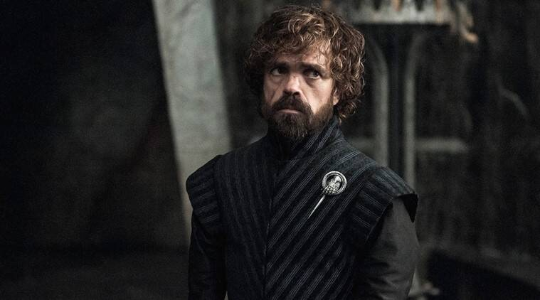

    

# DinkleBot

Dinklebot is a companion app for [Destiny 2](https://www.bungie.net/7/en/Destiny/BeyondLight). I plan to use learn about modern swift patterns

- [Learning Topics](#learning-topics)
- [Features](#features)
- [Why the Name](#way-the-name)

## Learning Topics
- [x] Use coordinator pattern
- [ ] Use MVVM
- [ ] Use [Realm](https://github.com/realm/realm-cocoa)
- [ ] Use [Alamorfire](https://github.com/Alamofire/Alamofire)
- [ ] Unit Tests
- [ ] Integration Tests
- [ ] Snapshot Tests
- [ ] XCUITests
- [ ] Add [SwiftLint](https://github.com/realm/swiftlint) or [swift-format](https://github.com/apple/swift-format)

## Features

- [ ] Show the current mods available at Banshee 44 and Ada 1 for today
- [ ] Show if the current player has these mods
- [ ] Show if the current player has these mods

## Why the Name
Where did the name "Dinklebot" come from initially?
>Ghosts were sometimes called "Dinklebots" by players, as a nod to Peter Dinklage,[23](https://www.destinypedia.com/Ghost#cite_note-23) who provided their voice in the game. As of The Taken King, Nolan North replaced Dinklage as Ghost's voice actor and redubbed lines from the original Destiny game.[24](https://www.destinypedia.com/Ghost#cite_note-24) Players have started to call this new Ghost "Nolandroid", though Nolan North himself prefers "Nolanbot".[25](https://www.destinypedia.com/Ghost#cite_note-25)

From https://www.destinypedia.com/Ghost
